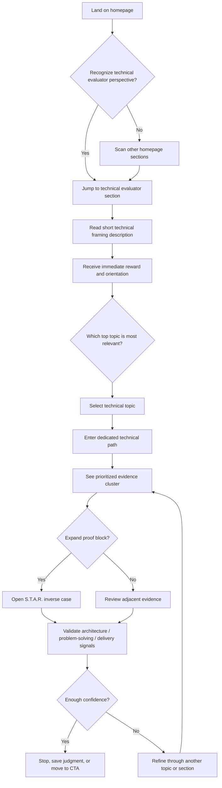
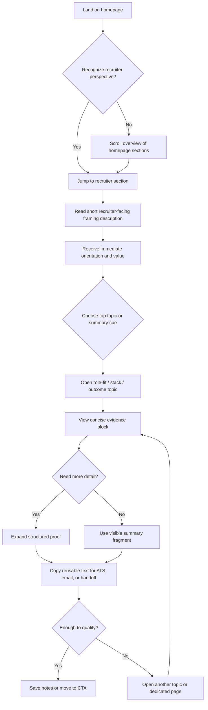
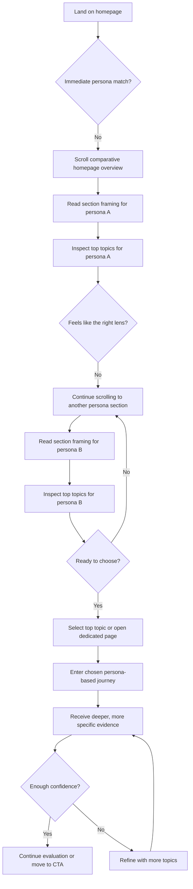

---
stepsCompleted:
  - step-01-init
  - step-02-discovery
  - step-03-core-experience
  - step-04-emotional-response
  - step-05-inspiration
  - step-06-design-system
  - step-07-defining-experience
  - step-08-visual-foundation
  - step-09-design-directions
  - step-10-user-journeys
  - step-11-component-strategy
  - step-12-ux-patterns
  - step-13-responsive-accessibility
  - step-14-complete
inputDocuments:
  - /workspaces/alecsg77-portal/_bmad-output/planning-artifacts/product-brief-alecsg77-portal-2026-02-27.md
  - /workspaces/alecsg77-portal/_bmad-output/planning-artifacts/prd.md
date: '2026-03-08'
author: Alessio
workflowType: ux-design
lastStep: 14
---

# UX Design Specification alecsg77-portal

**Author:** Alessio
**Date:** 2026-03-08

---

<!-- UX design content will be appended sequentially through collaborative workflow steps -->

## Executive Summary

### Project Vision

alecsg77-portal is a static-first bilingual web experience designed to reduce evaluation uncertainty around a senior professional profile. Rather than forcing visitors to interpret a dense CV or read a long-form portfolio, the product helps different evaluators reach relevant, verified evidence quickly through guided discovery, contextual navigation, and progressive disclosure. The UX should make the public experience feel immediately understandable, trustworthy, and operationally useful while preserving the strict separation between the private offline-first content pipeline and the public static publishing surface.

### Target Users

The primary user is a technical evaluator such as a CTO, VP Engineering, or Tech Lead who needs quick access to concrete proof of competence without reading unnecessary narrative. This user values signal density, specificity, and reusable evidence, and expects to enter the experience through technical questions, capabilities, architecture themes, or outcome-oriented proof.

A secondary user is a recruiter or talent sourcer who needs to assess relevance rapidly and extract structured text for screening, ATS notes, or internal handoff. This user benefits from clear summaries, low-friction entry points, business-readable framing, and copy-ready content that reduces interpretation effort.

A supporting internal user is the author-administrator, who maintains the private content pipeline, reviews canonical artifacts, and republishes the public experience without relying on live systems. For this user, the public UX must reflect editorial rigor and control without exposing operational complexity.

### Key Design Challenges

The experience must compress a broad and multi-dimensional career history into a structure that feels fast to scan without flattening meaningful context. It must support different entry mental models, allowing technical evaluators, recruiters, and other visitors to reach useful content without forcing a single browsing strategy.

The product also needs to establish trust without AI theatrics. Credibility should come from orientation, structure, labeling, affordances, and visible evidence patterns rather than from assistant-like behavior that could distract from the content itself.

A further challenge is preserving coherence across bilingual content, responsive layouts, and strict performance expectations, ensuring that navigation, search, language switching, and progressive disclosure remain equally understandable and usable across desktop and mobile.

The UX must also balance flexibility with discipline: multiple discovery paths are valuable only if they remain clearly prioritized, easy to understand, and grounded in a canonical content model that does not create editorial drift or operational complexity.

A critical challenge for the initial experience is avoiding orientation failure. The homepage and top-level navigation must communicate what the product is, who it is for, how to start, and where value is located within seconds, otherwise users may perceive the experience as dense, impressive, but inefficient.

### Design Opportunities

The strongest UX opportunity is to position the interface as a signal-first evaluation surface rather than as a traditional resume, portfolio, or AI showcase. This creates a differentiated interaction model centered on qualification speed, evidence retrieval, and structured exploration.

Another opportunity is to make progressive disclosure a signature interaction pattern: each item can first expose the exact question or evaluation angle being answered, then reveal the supporting case study only when the visitor chooses to go deeper. This helps both technical evaluators and recruiters decide quickly where to invest attention.

A third opportunity is to design the information architecture around multiple valid paths into the same canonical content, such as by capability, project, domain, or outcome. If done well, this can make the product feel simultaneously richer and simpler, because each audience can start from the mental model that is most natural to them.

A final opportunity is to shape the homepage and top-level navigation around a clearly prioritized guided path based on evaluation intent, with secondary routes supporting alternate user intents without diluting the initial promise of speed, trust, and clarity.

## Core User Experience

### Defining Experience

The core experience of alecsg77-portal is fast professional evaluation through guided discovery. Users are not here to browse for its own sake; they are here to reduce uncertainty and decide whether deeper evaluation or contact is justified. The experience should let them orient immediately, choose the most relevant path, inspect meaningful evidence, and decide the next step with minimal interpretation effort. The defining interaction is the transition from summary-level orientation to context-specific proof, where a visitor identifies a relevant evaluation angle and reveals the supporting case study only when needed.

### Platform Strategy

The product should be designed as a web-first experience optimized for desktop and fully usable on mobile. Desktop will likely be the primary environment for recruiters and technical evaluators during screening or review workflows, but the core paths must remain coherent and usable on smaller mobile viewports. The interaction model should assume mouse and keyboard first, while preserving strong touch usability for navigation, expansion, language switching, and CTA flows. Because the MVP is static-first, the platform strategy should emphasize fast loading, predictable behavior, low-friction navigation, and graceful operation without dependence on complex runtime systems.

Mobile support should preserve not only feature access but also interaction priority. The dominant entry path, the first useful action, the product value framing, and the movement from summary to evidence must remain just as legible and decisive on smaller screens.

### Effortless Interactions

Users should immediately understand how to begin. The initial experience must make the first useful action obvious, reducing hesitation and avoiding orientation debt. That first move should be framed around evaluation intent, so both technical evaluators and recruiters can recognize it as relevant without needing to decode the interface structure first. Effortless interaction in this product means reducing unnecessary decisions, not adding theatrical automation.

Switching from high-level summary to a relevant path should feel natural and require little cognitive effort. Progressive disclosure should be effortless: users should be able to scan a question, judge its relevance, and reveal deeper evidence without losing context. The revealed content should feel like proof, not like another layer of introduction, by surfacing evaluative context and meaningful outcomes quickly. Search, language switching, and movement across alternate navigation paths should also feel lightweight and reversible, but they must not compete with the dominant first move. Secondary routes should behave as refinement tools, not as equally weighted starting points. The experience should eliminate unnecessary interpretation steps that traditional CVs and dense portfolios usually force on the reader.

### Critical Success Moments

The first critical success moment happens within the first few seconds, when the visitor understands what this product is, who it is for, and how to start. If this orientation fails, the rest of the experience loses value.

The second critical moment occurs when the user reaches the first piece of evidence that feels specifically relevant to their evaluation goal. This is the moment where the experience proves it is more useful than a static CV or generic portfolio, because it produces relevant proof faster than a traditional reading flow.

Another make-or-break moment is the first progressive disclosure interaction. If expanding content feels confusing, low-value, or too verbose, the product loses its promise of speed and signal density. Success happens when users feel they can move from question to evidence to next step without friction.

### Experience Principles

- Prioritize decision support over passive browsing.
- Prioritize evaluation speed over narrative completeness.
- Make the first useful action obvious within seconds.
- Frame the dominant first move around evaluation intent, not taxonomy alone.
- Let users move from intent to evidence with minimal cognitive load.
- Use structure and labeling to create trust before depth is required.
- Keep every path grounded in the same canonical content model.
- Treat progressive disclosure as the central interaction, not a secondary enhancement.
- Preserve a single dominant first move, even when secondary routes exist.
- Ensure mobile preserves cognitive priority, not just functional parity.

## Desired Emotional Response

### Primary Emotional Goals

The primary emotional goal of alecsg77-portal is to make users feel clear-headed, confident, and ready to decide. The experience should reduce the uncertainty and mental friction that usually accompany the evaluation of a senior profile, replacing them with clarity, control, professional relief, and decision readiness. That sense of relief should begin as early as the first orientation layer, not only after deeper exploration.

A secondary emotional goal is to create professional trust without coldness. Users should feel that the content is structured, intentional, and credible, not inflated, theatrical, or overly polished. The product should feel serious and high-signal, but still accessible, respectful, and supportive rather than distant.

### Emotional Journey Mapping

At first discovery, users should feel immediate clarity rather than cognitive load. The product should quickly answer what it is, who it is for, and how to begin, creating an early sense that this experience will save time rather than consume it.

During the core experience, users should feel guided rather than constrained. As they move from summary to evidence, the emotional tone should shift toward confidence, relief, and validation: the system is helping them reach relevant proof without unnecessary work.

After completing their task, users should feel efficient, decision-ready, and more certain about their next move, whether that means continuing evaluation, sharing findings internally, or initiating contact. The experience should leave them with the sense that their time was well spent and that the product supported judgment rather than pushed conversion.

If something does not match their needs, the experience should still leave them with a sense of honesty, orientation, respect, and trust. The product should feel transparent about limits rather than evasive, abrupt, or overpromising, preserving professional dignity even in mismatch cases.

When returning, users should feel familiarity, speed, and confidence that they can re-enter the experience and reach useful evidence quickly.

### Micro-Emotions

The most important micro-emotions for this product are confidence over confusion, trust over skepticism, relief over friction, and readiness over hesitation. These matter more than delight in the traditional consumer-product sense.

A smaller but still valuable emotional layer is quiet reassurance: the feeling that the experience is well structured, professionally credible, and unlikely to waste time. For the right audience, this should produce a subtle sense of ease and forward motion.

The emotional states to avoid are confusion, skepticism, overload, ambiguity, coldness, hesitation, pressure, and the feeling that the interface is trying too hard to impress instead of helping the user evaluate.

### Design Implications

To support confidence, the UX should use clear labeling, obvious entry points, consistent hierarchy, and evidence-first disclosure patterns. Users should understand where they are and why a given piece of content matters before they are asked to process detail.

To support trust, the interface should avoid gimmicky interaction patterns, inflated claims, or AI-coded theatrics. Trust should emerge from semantic clarity, disciplined structure, readable content blocks, predictable behavior, and language that feels useful rather than defensive.

To support relief and decision readiness, the system should reduce unnecessary decisions, keep navigation reversible, and make the first valuable interaction happen quickly. The experience should feel composed, precise, and useful rather than dense, performative, or emotionally flat.

### Emotional Design Principles

- Replace uncertainty with clarity as early as possible.
- Create professional relief at the first orientation layer, not only after exploration.
- Use structure to create confidence before asking for attention.
- Make trust a consequence of design discipline, not promotional language.
- Reward exploration with relevance, not with more complexity.
- Keep the experience composed, precise, and respectful of professional time.
- Support judgment and decision readiness, not just comprehension.
- Avoid both theatricality and emotional coldness.
- Avoid pressure while still making next steps clear.
- When limits exist, communicate them with honesty, respect, and orientation.

## UX Pattern Analysis & Inspiration

### Inspiring Products Analysis

The strongest inspiration benchmark for alecsg77-portal is Basecamp Paths. Its most relevant contribution is not the visual style itself, but the idea of presenting navigation as a journey that adapts to who the visitor is and what they need to validate. This is especially relevant for a complex professional profile where skills and credibility are not the result of a single experience, but of a layered career path built over time. The main limitation to avoid is excessive scrolling before the user reaches meaningful value.

A secondary inspiration comes from 37signals Signals. The most relevant pattern here is the use of key ideas rather than keyword-based navigation. This supports a more intentional and editorially guided experience. The main limitation is the overly flat single-level navigation and the strong color shifts, which do not suit the calmer and more structured experience this portal needs.

Loom Use Cases is useful less as a role-label model and more as an example of scenario-led entry points. Its strongest transferable pattern is the idea that the landing experience can begin from a recognizable evaluation need or context. However, the portal should avoid repetitive card labeling patterns and overly generic persona definitions based only on job titles, since those labels often fail to express the real evaluation need behind the visit.

HubSpot's guided persona flow is more relevant for a future iteration than for the current MVP, but one key pattern is still valuable: a short sequence of prior choices can progressively generate a more precise route. For the current version, this should be implemented through curated branching choices rather than through freeform text input.

Stripe Guides provides a useful structural pattern for content organization. The most relevant ideas are a more dynamic card layout and the combination of highlighted top topics with an option to view everything. For this portal, the first section could act as a table of contents for the page: clicking a card would scroll to the corresponding subsection, where users could then choose whether to inspect top highlights or open the full set of related content.

### Transferable UX Patterns

The most important transferable pattern is guided path navigation. Instead of asking users to search blindly, the portal should help them identify what they need to validate and then follow a path toward relevant proof.

Another strong pattern is using evaluation keys rather than raw keywords as the first navigational layer. Users should begin from meaningful frames such as intent, challenge, outcome, proof angle, or review context rather than from a generic search taxonomy.

A third transferable pattern is controlled narrowing through a short semantic question sequence. Rather than forcing users into a single coarse path selection, the portal can progressively narrow the most relevant route through a few curated questions with meaning-rich answers.

A critical refinement is that the path must return useful value immediately. The first choice or branching step should already expose an approximate but relevant result, so users feel rewarded early rather than forced to complete the full path before seeing anything useful. Subsequent steps should refine, focus, and deepen the result rather than acting as a gate to the first meaningful insight.

A fourth valuable pattern is using the first section of a page as an active table of contents. This would allow the landing area to orient the user, expose the main journey options, and create immediate movement toward the right section instead of forcing long passive scrolling.

Finally, the content model should treat the career as a sequence of accumulated proof points rather than a flat archive or a purely chronological autobiography. This makes the portal feel like a guided reading of professional evidence rather than a simple collection of cards.

### Anti-Patterns to Avoid

The strongest anti-pattern to avoid is long-scroll delay before value. If users have to scroll too much before reaching the first useful proof or branching point, the experience will feel heavy instead of guided.

Another anti-pattern is relying on keyword-first search or filterable catalog structures as the dominant entry point. That model pushes users into retrieval mode too early and weakens the sense of curated evaluation.

The portal should also avoid repetitive card naming systems, especially patterns that flatten user intent into generic job-title categories. Persona framing should reflect evaluation needs, not just professional labels.

Single-level navigation without strong hierarchy is another anti-pattern. The experience needs a clearer progression from orientation to path selection to evidence.

For the current version, both freeform written input and rigid low-signal answer sets are anti-patterns. The experience should not feel like filling a form or clicking through shallow yes-no logic where richer semantic choices are needed.

Another anti-pattern is delayed payoff. If the early steps only collect signals from the user without returning immediate relevance, the path will feel extractive rather than helpful.

### Design Inspiration Strategy

The main structural inspiration should come from Basecamp Paths: use a journey model where visitors identify themselves through evaluation context, enter a tailored route, and interpret the profile through a sequence of meaningful stages rather than through generic browsing.

From 37signals Signals, adopt editorial navigation by key ideas rather than keyword-oriented retrieval. This supports a more intentional and high-signal reading experience.

From Loom Use Cases, adapt the scenario-first entry logic, but rewrite it so that entry points are defined by evaluation intent or context rather than by generic role labels.

From HubSpot's guided flow, adopt the principle of progressive route generation through prior answers, but adapt it into a short constrained-choice sequence suitable for a static-first experience. This sequence should narrow intelligently without becoming long, mechanical, or form-like, and it should produce a useful first result as early as possible.

From Stripe Guides, adopt the idea of a dynamic content index with top topics plus deeper exploration. In this portal, that pattern should become a TOC-like landing section that allows users to jump to the right subsection and then choose between highlighted evidence and broader exploration.

Overall, the portal should combine guided context-based entry, editorially framed navigation, controlled narrowing, early reward, and TOC-driven page structure into a calm, high-signal journey that feels curated rather than searchable.

## Design System Foundation

### 1.1 Design System Choice

alecsg77-portal should use a lightweight custom design system with strong technical guardrails, rather than a fully established visual UI framework or a fully hand-built component stack. The product needs a calm, editorial, journey-driven interface with a small number of highly controlled components, not a broad catalog of application-style widgets.

The visual language, interaction rhythm, and component semantics should be custom and product-specific only where they shape the distinctive experience of the portal. The technical foundation should remain conservative: native HTML should be preferred wherever sufficient, and only a minimal vetted primitive layer should be considered for interaction patterns that are difficult to implement accessibly from scratch.

### Rationale for Selection

A lightweight custom system is the strongest fit because the product's value depends on guided narrative structure, high-signal presentation, and carefully staged interaction rather than on generic UI coverage.

Established design systems such as Material Design or Ant Design would accelerate development, but they would also push the experience toward an app or dashboard aesthetic that conflicts with the desired calm, editorial, evidence-first character of the portal.

At the same time, a full custom implementation without guardrails would create unnecessary risk by forcing the project to rebuild standard interaction behavior from scratch. The selected approach avoids both extremes: it preserves visual and interaction uniqueness where it matters, while reducing the implementation burden for behavior that does not create product differentiation.

### Implementation Approach

The implementation should start from design tokens rather than from a large external component library. Typography, spacing, color, border radius, elevation, and motion rules should be defined first, followed by a deliberately small set of core components tailored to the guided-path experience.

The first implementation wave should prioritize the patterns that define the product's UX: orientation blocks, branching choice cards, TOC modules, evidence cards, progressive disclosure sections, path indicators, metadata rows, language switching, and low-pressure CTA blocks.

Native HTML elements should be used wherever they are sufficient. If external primitives are needed for accessibility-critical interaction patterns, they should come from a single vetted headless foundation, be wrapped internally, and remain replaceable rather than structurally central to the product.

### Customization Strategy

Customization should focus on making the system feel composed, legible, and high-signal. Typography should carry a large part of the identity, supported by disciplined spacing, restrained color use, and clear hierarchy.

The system should avoid heavy visual chrome, dashboard-like controls, or overly generic component styling. Components should feel content-led rather than framework-led.

A small number of variants should be defined intentionally. Instead of offering many interchangeable component styles, the system should emphasize semantic clarity: each component type should have a distinct job in the guided journey.

To avoid dependency sprawl and maintenance risk, the system should follow explicit guardrails: prefer native-first implementation, allow at most one primitive/headless dependency layer if required, wrap external dependencies internally, require each new UI dependency to justify the specific risk it removes, and keep the initial component inventory and complexity budget tightly scoped.

Any new component should justify either direct reuse across multiple guided-path contexts or clear importance to the core experience. One-off components should be treated as exceptions to minimize rather than as a normal extension path. Any headless foundation should be confined to interaction primitives and should not become a diffuse dependency across the entire UI layer.

As the product evolves, the design system can expand carefully, but the initial release should optimize for consistency, editorial control, implementation safety, and ease of maintenance over breadth.

## 2. Core User Experience

### 2.1 Defining Experience

The defining experience of alecsg77-portal is fast evidence convergence through guided evaluation narrowing. Users begin from an evaluation context, receive an immediate approximate match, and then refine the path until they reach the most relevant proof for what they need to validate. The experience is not generic browsing and not traditional search. Its value comes from helping users confirm or reject an evaluation hypothesis quickly through a guided sequence that returns useful evidence early and sharpens confidence with each step.

If this interaction works well, the rest of the product follows naturally: navigation feels purposeful, disclosure feels justified, and the portal becomes meaningfully different from a static CV or a filterable portfolio.

### 2.2 User Mental Model

Users likely arrive with the mental model of screening a profile under time pressure. Today they solve this problem through CV scanning, LinkedIn skimming, portfolio browsing, or ad hoc keyword search. They are used to either linear reading or fragmented retrieval.

What they really want, however, is not more browsing freedom. They want the shortest path to evidence that supports or rejects a working hypothesis: "Can this person handle this kind of challenge?" or "Is this profile relevant enough to move forward?"

Because of this, users will likely understand the product best if it behaves less like a catalog and more like a guided evaluation assistant without chatbot theatrics. They should feel that the system is helping them narrow intelligently, not forcing them to search manually or read everything in order.

### 2.3 Success Criteria

The core experience succeeds when users immediately understand how to begin and feel rewarded by the very first choice they make. The first branching step should already surface a relevant, if still approximate, result that is good enough to justify continuing and specific enough to feel credible.

Users should then feel that each additional step increases confidence rather than increases effort. Refinement should feel like sharpening focus, not like filling out a questionnaire or progressing through a generic wizard.

The experience should feel fast, readable, and confidence-building. Users should say, in effect, "this is already pointing me in the right direction" after the first interaction, and "this gave me enough proof to decide" after refinement. They should also be able to stop early when the available proof is already sufficient for their decision.

### 2.4 Novel UX Patterns

The experience combines familiar and novel patterns. It uses familiar interaction building blocks such as cards, branching choices, anchored sections, progressive disclosure, and guided narrowing. These reduce the need for user education.

What is more distinctive is the way these familiar patterns are combined into an evaluation journey. Instead of search-first discovery or chronological storytelling, the portal begins with context recognition, returns immediate approximate relevance, and then converges toward proof through a staged path.

This means the UX should feel innovative in structure, but not unfamiliar in mechanics. Users should understand what to do without tutorial overhead, even if the overall flow feels more curated than typical profile browsing.

### 2.5 Experience Mechanics

**1. Initiation**

The user lands on a page that immediately frames the product, the type of visitor it serves, and how to begin. The opening interaction presents a small number of curated evaluation entry points or semantic questions designed to identify intent quickly.

**2. Interaction**

The user selects an evaluation angle, scenario, or need state. Based on that choice, the system immediately returns a first relevant path, cluster, or evidence shortlist, along with a clear indication of why that result is relevant. The user can then refine through a short sequence of meaning-rich choices that increase specificity without feeling mechanical.

**3. Feedback**

Each choice produces visible progress and immediate relevance. The user should see that the system understood the direction of the request even before the path is fully refined. Labels, section titles, highlighted evidence, path indicators, and relevance cues should all confirm that the experience is converging on the right material.

**4. Completion**

The user reaches a proof-rich section where the most relevant evidence is visible, expandable, and easy to interpret. At that point, the interaction feels complete because the user can either stop with a sufficient answer or continue refining and exploring related evidence. Completion is defined by confidence in the evaluation decision, not by finishing every step in the path.

## Visual Design Foundation

### Color System

The default visual foundation for alecsg77-portal should follow the Research Archive direction, interpreted not as a neutral corporate style but as the professional expression of the same underlying identity. The primary palette should be light, calm, and systematic, using cool neutrals and archive-like tones that reinforce clarity, rigor, and trust while still carrying enough character to feel authored rather than generic.

The primary mode should represent the professional face of the product's identity because that is the expression best suited to fast evaluation, high readability, and confident decision-making. A restrained technical accent system should remain visible through subtle monospace labels, metadata markers, and selected accent tones. These elements should signal technical depth without overwhelming the broader professional readability required for recruiters and evaluators.

The secondary style should draw from Soft Terminal Minimalism and should be understood as the geek-facing expression of the same identity rather than as a separate visual experiment. It should introduce darker surfaces, phosphor-inspired accents, and a stronger technical atmosphere while preserving the same information architecture, hierarchy, interaction logic, and design grammar.

### Typography System

The primary typography system should support long-form readability and high-signal scanning. A serif or editorial display face should be used selectively for major headings and section-defining moments, while a highly legible sans-serif should handle body text, UI text, and navigational structure.

Monospace typography should be used sparingly but intentionally in both modes. It should anchor metadata, labels, path markers, state indicators, and trust cues so that the technical identity remains present in the professional mode and becomes more explicit in the geek-facing mode.

The hierarchy should create strong distinction between orientation, path selection, evidence blocks, and decision points. Typography should carry a large share of the interface's authority and pacing while also acting as one of the key bridges between the two visual expressions.

### Spacing & Layout Foundation

The layout foundation should follow the Research Archive logic: modular, structured, and spacious enough to preserve clarity under high information density. The page should feel ordered rather than airy for its own sake, with enough breathing room to make evidence blocks readable and paths understandable.

Spacing should follow a disciplined system with clear vertical rhythm between stages, sections, and evidence clusters. The layout should support a strong top-down reading order, clear section transitions, and visible stopping points where users can decide whether to continue refining or stop with enough proof.

The alternate Soft Terminal Minimalism style should reuse the same layout system rather than redefining it. Only surface treatment, accent behavior, and tonal atmosphere should shift between styles. The structure and component grammar of the product must remain stable because both styles are two faces of the same experience, not two different interfaces.

### Accessibility Considerations

The default Research Archive style should remain the accessibility baseline. Contrast, hierarchy, spacing, and reading comfort should be optimized first in this mode so that the product remains highly legible for recruiters and evaluators under time pressure.

The secondary Soft Terminal Minimalism style must preserve the same accessibility guarantees. It should not rely on dim low-contrast terminal nostalgia, decorative glow effects, or dense dark surfaces that reduce readability over time.

If a style switch is introduced, it should be framed as a shift between identity lenses rather than as a basic light/dark toggle. The primary lens should express the professional self, while the secondary lens should express the geek-facing self. The switch should behave as a stable alternate mode rather than as a gimmick or hidden joke, while remaining clearly understandable, discoverable, and accessible.

## Design Direction Decision

### Design Directions Explored

The design exploration focused on a set of structural directions within the same visual family, first compared as numbered variants and then reduced to a smaller set of meaningful roles. The comparison clarified that the most useful distinction was not theme alone, but homepage posture, routing logic, and how early value is delivered.

The balanced archive baseline represented a calm editorial reference with guided paths embedded inside a neutral composition. The Persona-First Homepage TOC emphasized a homepage structure where orientation and path selection are the dominant first experience. Denser briefing and dossier-like alternatives were explored and then excluded because they increased density or introduced unnecessary framing without improving the chosen homepage model. A more technically authored archive variant was retained because it added a stronger metadata language, clearer technical cues, and a better tonal bridge toward the secondary geek-facing lens.

After review, the exploration converged on three retained references with distinct roles rather than on a longer list of numbered variants. The chosen structure is the Persona-First Homepage TOC. The Technical Signal Layer is retained as the strongest tonal influence inside that structure. The Restraint Baseline remains as the reference for calm, readability, and editorial control if the combined result becomes too directive or too stylized.

### Chosen Direction

The chosen direction for alecsg77-portal is the Persona-First Homepage TOC.

This should not be understood as a rigid branching gate or as a generic site index. The homepage should use persona-aligned entry points as its primary organizing structure, but those entry points should also function as the table of contents for the homepage itself.

Visitors who immediately recognize the perspective closest to their intent should be able to jump directly to the relevant section of the homepage. Visitors who are less certain should still be able to scroll through the homepage and compare the main topics exposed under each perspective.

Each persona-oriented section should begin with a short framing description that provides immediate value even before the user selects a topic. This opening description should already speak in a relevant language for that visitor perspective and provide a broad but useful first layer of orientation.

After that framing block, each section should present a tightly curated top list of the most important themes, questions, or proof areas for that route. Those top items are not only navigational previews; they should also work as valid first steps into the dedicated path. Users should be able to recognize one of those topics as immediately relevant and enter the deeper path from there.

From that point, users can either stop at the high-value overview, enter the path from one of the top topics, continue into a dedicated page that exposes the full set of topics for that persona or path, or keep scrolling across other persona-oriented sections if they are still comparing possible starting points.

The Technical Signal Layer remains the preferred secondary influence. It should shape the tone of evidence modules, metadata rows, labels, and technical cues inside this persona-first TOC structure without replacing it.

### Design Rationale

The homepage should help visitors start from the perspective that best matches how they want to evaluate the profile, but it should not force an immediate hard commitment before exposing value.

For that reason, the persona-first model works best when it also behaves as a visible homepage TOC. It allows confident users to jump directly to the section most relevant to them, while allowing uncertain users to scroll and compare the top themes across multiple perspectives before deciding where to go deeper.

The homepage should therefore be understood not as a page before the journey, but as the first layer of the journey itself. Entering a persona-oriented section is already a meaningful first step because that section should provide an immediate reward: a brief but valuable framing description written in language relevant to that visitor perspective.

After this first value-bearing layer, the user can choose one of the top topics as the first explicit deeper step into the path. This creates a progression from perspective recognition, to immediate contextual value, to topic-level path entry, without forcing users to wait until the end of the journey before receiving anything useful.

The model must also remain structurally disciplined. The homepage cannot try to fully deliver every path in place. Each persona-oriented section should function as a concise micro-landing, not as a full destination. It should provide a short framing introduction, a brief value-bearing description, a tightly curated top list of first-step topics, and a clear route toward deeper exploration.

This preserves the promise of early reward without overloading the homepage or weakening the clarity of the dominant first move. The Persona-First Homepage TOC is therefore the right structural choice because it can support immediate routing, exploratory scanning, and early value delivery inside the homepage itself.

The Technical Signal Layer remains important because it gives the sections and evidence modules a stronger authored technical voice once the user enters a given path. The Restraint Baseline remains useful only as a control reference if the combination of the chosen structure and the tonal layer becomes too directive, too dense, or too visually insistent.

### Implementation Approach

Implementation should treat the Persona-First Homepage TOC as the homepage architecture, with layered depth and strict scope control.

The opening area should contain:
- a concise framing block
- a small set of persona- or perspective-based entry points
- anchor-style navigation that scrolls directly to the corresponding homepage section

Each homepage section should then function as a concise micro-landing for that visitor perspective and contain:
- a short framing introduction for that perspective
- a brief value-bearing description that acts as the immediate reward for entering the section
- a tightly curated top list of the most relevant topics or proof areas
- topic items that can function as direct first steps into the dedicated path
- a clear path toward a dedicated page with the complete list for that route

This allows four valid behaviors:
- confident users can identify their path immediately and jump straight into it
- users can receive immediate value from the section framing before making any deeper choice
- users can recognize a top topic as relevant and enter the deeper path directly from that first-step list
- uncertain users can scan the homepage as a comparative overview across perspectives before deciding where to go deeper

The homepage should not attempt to become the full path itself. Its job is to start the path well, prove relevance early, and hand off to deeper dedicated pages before cognitive load rises too far.

The Technical Signal Layer should influence the expression of these sections and their content modules:
- stronger metadata rows
- more visible technical markers
- sharper evaluative labels
- a more authored technical cadence across evidence modules

The Restraint Baseline remains only a control reference if the combined result becomes too directive, too dense, or too visually insistent.

## User Journey Flows

The public MVP is built around two core evaluation journeys and one orientation layer.

The two core journeys exist because they reflect the two primary ways the profile needs to be evaluated in the public experience:
- technical depth validation
- recruiter-style screening and handoff preparation

Alongside them, the homepage also supports a comparative orientation flow for visitors who are not immediately sure which perspective matches their intent. This orientation layer is essential to the homepage model, but it should not be treated as a full third persona journey.

### Technical Evaluator Deep Dive

This is one of the two primary public journeys. Its purpose is to help a technical evaluator validate architecture judgment, problem-solving depth, delivery credibility, and technical leadership without forcing linear reading.

The journey begins when the visitor recognizes the technical-evaluator perspective in the homepage routing layer. After jumping to that section, the user receives immediate value through a short framing description written in technical evaluation language. That framing acts as the first reward and confirms that the path is aligned with the visitor's intent. The user then selects one of the curated top topics as the first explicit deeper step, enters the dedicated path, and progressively expands evidence blocks until enough confidence is reached to stop, continue browsing, or move toward contact.

### Recruiter Screening and Handoff

This is the second primary public journey. Its purpose is to help a recruiter or talent sourcer qualify the profile quickly, gather reusable evidence, and move toward handoff or contact with minimal friction.

The journey begins either from the recruiter-oriented homepage entry point or from general scanning of the homepage. Once inside the recruiter section, the user receives immediate value through a short summary framed around fit, scope, outcomes, and relevance. From there, the user can choose one of the top topics, expand the relevant evidence, and extract concise fragments for reuse. The ideal outcome is not full exploration, but quick qualification plus reusable notes.

### Comparative Orientation Flow

This is not a third primary journey. It is the orientation layer that supports visitors who do not immediately recognize which evaluation perspective fits them best.

Its role is to let the homepage function as a comparative overview across persona-aligned sections, so that uncertainty is handled through guided scanning rather than through forced early commitment.

The flow begins with uncertainty rather than recognition. Instead of forcing a premature choice, the interface allows the visitor to scroll through multiple persona-oriented sections, each offering a short reward-bearing framing description and a curated top list. The user compares tone, framing, and topic emphasis until one section feels closer to the desired evaluation posture. At that point, the visitor enters the relevant persona-based journey from a top topic or dedicated page link.

### Journey Patterns

**Primary persona-based journeys**
- Technical Evaluator Deep Dive
- Recruiter Screening and Handoff

**Cross-cutting orientation flow**
- Comparative Orientation Flow

**Navigation Patterns**
- The homepage acts as a persona-first TOC and as the first layer of the journey.
- Entry points should support both direct jumps and exploratory scrolling.
- Each persona section should offer both top-topic entry and a route to the full dedicated page.

**Decision Patterns**
- First decision: choose or recognize an evaluation perspective.
- Second decision: decide whether the immediate section value is already enough or whether to go deeper.
- Third decision: choose which top topic becomes the first explicit step into the path.

**Feedback Patterns**
- Immediate reward appears at section entry through a short, value-bearing framing description.
- Deeper reward appears when a top topic reveals evidence that feels specifically relevant.
- Progress is communicated through clearer specificity, not through wizard-like completion steps.

### Flow Optimization Principles

- Prioritize two real evaluation journeys, not an inflated list of scenarios.
- Treat homepage comparison as orientation support, not as a third full path.
- Make the dominant first move obvious, but do not punish uncertainty.
- Deliver value before demanding commitment to the full path.
- Keep persona sections concise so the homepage remains navigable and comparable.
- Phrase top topics as meaningful evaluation questions, not as internal taxonomy.
- Let the top topics become the first explicit deeper step.
- Let users stop early when they have enough evidence.
- Preserve different language and evidence emphasis across persona paths so the branching feels real.
- Keep the homepage as level zero of the journey, while routing depth to dedicated pages before cognitive load rises too far.

## Component Strategy

### Design System Components

The project should continue using the lightweight custom design system with strong technical guardrails defined earlier. This means the component strategy should begin from design tokens and native-first building blocks rather than from a large third-party UI catalog.

The effective foundation layer should include:
- typography tokens
- spacing and layout tokens
- color and surface tokens
- border, radius, and elevation tokens
- motion and transition rules
- native semantic primitives for headings, navigation, lists, buttons, links, disclosure, and form controls where needed

These are sufficient for the baseline editorial system, but they do not fully cover the product's custom interaction model. The user journeys and design direction introduce several needs that go beyond generic foundation components.

The main gaps are:
- a homepage routing pattern that combines persona-based entry, comparative scanning, and anchor navigation
- a persona-section pattern that behaves like a concise micro-landing with immediate reward
- a topic-entry pattern where top topics are both previews and valid first explicit steps into a path
- an evidence presentation pattern optimized for progressive disclosure, technical trust, and copy-readiness
- a metadata language that expresses the Technical Signal Layer without creating a separate design system

### Custom Components

### Persona Routing Rail

**Purpose:** Help users identify the evaluation perspective that best matches their intent and jump directly to the corresponding homepage section.
**Usage:** Use at the top of the homepage as the dominant first interaction.
**Anatomy:** Framing label, short perspective title, short explanatory line, optional cue about what changes after selection, anchor action.
**States:** Default, hover, focus, active-selected, compact mobile stack.
**Variants:** Primary homepage variant, secondary inline variant if repeated elsewhere.
**Accessibility:** Must be fully keyboard reachable, clearly announced as navigation, and expose destination meaning beyond generic labels.
**Content Guidelines:** Labels should express evaluation posture, not internal taxonomy. Titles should be short and immediately recognizable.
**Interaction Behavior:** Clicking scrolls to the corresponding homepage micro-landing section. Active state updates when the relevant section is in view.

### Persona Micro-Landing Section

**Purpose:** Act as the first layer of the journey for a given evaluation perspective by delivering immediate value before deeper commitment.
**Usage:** Use once per homepage perspective section.
**Anatomy:** Section heading, short framing introduction, value-bearing description, top-topic list, link to full dedicated path page.
**States:** Default, in-view highlighted, collapsed mobile rhythm, translated variant.
**Variants:** Technical-evaluator emphasis, recruiter emphasis, future additional perspective variants if needed.
**Accessibility:** Must preserve heading structure, support anchor arrival with clear focus destination, and maintain logical reading order.
**Content Guidelines:** The framing description must provide useful orientation immediately and remain short enough to preserve homepage scanability.
**Interaction Behavior:** Users can read the immediate reward, select a top topic, or continue scrolling without penalty.

### Top Topic Entry Card

**Purpose:** Present the most relevant first-step topics inside a persona section and allow direct entry into a deeper path.
**Usage:** Use inside persona micro-landings and possibly at the top of dedicated path pages.
**Anatomy:** Topic title, short evaluative framing, optional metadata cue, action affordance.
**States:** Default, hover, focus, active, visited.
**Variants:** Question-led variant, outcome-led variant, technical-depth variant.
**Accessibility:** Entire card should be reachable as a clear interactive target with strong focus indication and descriptive text.
**Content Guidelines:** Titles should read like meaningful evaluation questions or proof prompts, not generic category names.
**Interaction Behavior:** Selecting a card enters the corresponding deeper path or reveals the next layer of structured content.

### Evidence Block

**Purpose:** Present a proof fragment that can be scanned quickly, trusted rapidly, and expanded when needed.
**Usage:** Use within dedicated path pages and within deeper sections of the journey.
**Anatomy:** Context label, evidence title, short visible summary, optional metadata row, disclosure control, expanded S.T.A.R. inverse body.
**States:** Collapsed, expanded, hover, focus, copied, translated.
**Variants:** Technical proof, recruiter-readable proof, outcome summary, methodology emphasis.
**Accessibility:** Disclosure must be keyboard operable, state-announced, and readable in both collapsed and expanded states.
**Content Guidelines:** Visible summary should give enough information to justify expansion; expanded content should remain structured and copy-friendly.
**Interaction Behavior:** Users can inspect the summary, expand for full detail, and copy useful fragments without layout breakage.

### Component Implementation Strategy

The component strategy should minimize component proliferation and distinguish clearly between full components, shared subpatterns, and interaction behaviors.

**Core components**
These are the minimum components required to make the chosen UX model real:
- Persona Routing Rail
- Persona Micro-Landing Section
- Top Topic Entry Card
- Evidence Block

**Shared subpatterns**
These support consistency inside the core components but do not need to become fully separate top-level components at the start:
- Metadata Row
- framing summaries
- anchor-arrival highlighting
- compact mobile section rhythm

**Interaction behaviors**
These should initially be treated as behaviors or states inside existing components rather than as separate components:
- progressive disclosure
- copy-ready evidence presentation
- copied-state feedback

This approach keeps the component library small, preserves implementation discipline, and aligns with the original design-system decision to avoid a component zoo.

All core components should be built from the same token system and should preserve:
- semantic HTML first
- accessibility-first interaction behavior
- bilingual content support
- mobile and desktop parity
- consistency across technical and recruiter journeys

The Technical Signal Layer should be applied through typography, metadata, labels, and token usage rather than through a second component family. The Restraint Baseline should remain the control reference to prevent visual or structural over-design.

### Implementation Roadmap

**Phase 1 - Core structural components**
- Persona Routing Rail
- Persona Micro-Landing Section
- Top Topic Entry Card
- Evidence Block

**Phase 2 - Shared subpatterns and behaviors**
- Metadata Row
- progressive disclosure behavior within Evidence Block
- copy-ready evidence behavior
- anchor and section-state utilities

**Phase 3 - Refinement and scaling**
- additional variants only if repeated use across multiple paths proves necessary
- recruiter or technical emphasis variants only where content differences justify them

## UX Consistency Patterns

The pattern library for alecsg77-portal should prioritize the patterns that make the chosen UX model function, rather than aiming for a generic full-spectrum UI manual.

The product's consistency depends primarily on three moments:
- entering the right path
- understanding quickly why the visible content is relevant
- deciding whether to go deeper or stop with enough confidence

For that reason, patterns should be organized by strategic weight rather than by generic UI completeness.

### Core Consistency Patterns

These are the patterns that define the public experience and therefore require the strongest consistency rules:
- Navigation Patterns
- Progressive Disclosure and Evidence Patterns
- Button Hierarchy and Action Priority

### Supporting Consistency Patterns

These patterns support clarity, continuity, workflow quality, and identity expression, even when they do not define the core journey model on their own:
- Feedback Patterns
- Search Patterns
- Language Switch Patterns
- Identity Lens Switch Pattern
- Copy-Ready Interaction Patterns

### Low-Priority Patterns

These patterns should be defined conservatively in V1 and expanded only if implementation proves they are needed:
- Form Patterns
- Modal and Overlay Patterns
- Empty and Loading States beyond minimal baseline needs

### Button Hierarchy and Action Priority

Action hierarchy should remain extremely disciplined. The product is primarily a reading, evaluation, and routing experience, not an action-dense application.

**Primary actions**
Use primary emphasis only for actions that move the user meaningfully deeper into evaluation or toward a professional next step.

**Secondary actions**
Use secondary styling for supportive but non-dominant actions such as switching language, revealing more detail, or moving to adjacent topics.

**Quiet utility actions**
Use low-emphasis actions for copy support, anchor-return links, and section-level helpers.

**Consistency Rule**
No screen or section should present more than one visually dominant primary action at a time.

### Navigation Patterns

Navigation is the highest-priority consistency category because it carries the Persona-First Homepage TOC model and the movement from homepage orientation into dedicated evaluation paths.

**Homepage routing**
The homepage must consistently behave as a Persona-First Homepage TOC. Entry points should always indicate that they change perspective, not simply navigate to arbitrary sections.

**Anchor navigation**
Selecting a persona route should scroll to the relevant section and make arrival obvious through visual state change, heading clarity, and immediate reward content.

**Path entry**
Top topic cards should consistently behave as first explicit path steps, not as ambiguous hybrids between labels and links.

**Dedicated page navigation**
Once inside a deeper path, navigation should preserve orientation through clear page titles, visible relationship to the selected perspective, and nearby access to adjacent topics or return points.

**Consistency Rule**
Navigation should always answer three questions quickly:
- Where am I?
- Why am I seeing this?
- What is the next useful move?

### Progressive Disclosure and Evidence Patterns

Progressive disclosure is a defining pattern and should be treated as a top-level consistency category.

**Collapsed state**
The collapsed state should already contain enough meaning to justify attention.

**Expanded state**
The expanded state should reveal structured proof in a way that is easy to scan, trust, and reuse.

**Consistency Rule**
Expansion should always feel like moving from evaluative question to supporting answer, not from teaser to wall of text.

### Feedback Patterns

Feedback should be clear, lightweight, and respectful. The product should avoid notification-like noise and should instead use contextual reassurance.

**Success feedback**
Use subtle, local feedback for successful actions such as copying text, changing language, switching lens, or expanding an evidence block.

**Informational feedback**
Use calm inline cues to explain what just happened or what a section is for.

**Warning and error feedback**
Keep both rare, inline, and recovery-oriented.

**Consistency Rule**
Feedback should appear near the action that triggered it and should not detach users from the reading context.

### Search Patterns

Search should remain a secondary accelerator, not the primary interaction model.

**Usage**
Use search for known-item recovery, stack lookup, or rapid narrowing after orientation.

**Consistency Rule**
Search complements the persona-first routing model; it does not replace it.

### Language Switch Patterns

Language switching should preserve the same logical node whenever possible.

**Consistency Rule**
Changing language should not reset the user to an unrelated overview if an equivalent content node exists.

### Identity Lens Switch Pattern

The identity lens switch is distinct from language switching and should be treated as its own consistency pattern.

It does not change the logical content node, the journey structure, or the information hierarchy. It changes only the expressive lens through which the same experience is presented.

**Behavior**
- preserve the current page, section, and journey position
- preserve expanded or collapsed state where technically reasonable
- preserve the same logical content and navigation structure
- change only tone, surface treatment, metadata emphasis, and expressive cues

**Accessibility**
- the switch must be clearly labeled as a lens or style change, not as a joke or hidden mode
- the active state must be obvious
- contrast and readability must remain valid in both lenses

**Mobile Considerations**
The switch should remain discoverable but low-pressure. It should not compete with the dominant navigation actions.

**Consistency Rule**
Language switching changes linguistic expression.
Identity lens switching changes tonal expression.
Neither switch should break user orientation, reset context, or alter the core path structure.

### Copy-Ready Interaction Patterns

Copy support should be embedded in content surfaces, not treated like a productivity app feature.

**Consistency Rule**
The copied or copyable state should remain visually quiet and should never compete with reading and evaluation.

### Form Patterns

Form patterns remain low priority in the public MVP because the experience is not driven by data entry. Only lightweight search and selector interactions need explicit consistency rules at this stage.

**Consistency Rule**
If an interaction begins to require multi-step validation or heavy form affordances, it likely belongs outside the V1 public experience.

### Pattern Integration Rules

- Use the Technical Signal Layer through labels, metadata, and selective emphasis, not through competing interaction rules.
- Use the Restraint Baseline whenever a pattern starts to feel too loud, too dense, or too application-like.
- Keep mobile and desktop behavior logically equivalent, even when layout changes.
- Favor inline, contextual behavior over modal interruption.
- Prefer a small set of repeated patterns over many one-off exceptions.

## Responsive Design & Accessibility

The responsive and accessibility strategy for alecsg77-portal should be understood as a single continuity strategy.

Its purpose is not only to adapt layouts or satisfy compliance requirements. Its primary purpose is to preserve the product's journey logic across device size, input mode, language state, and identity lens.

The system succeeds only if users can still:
- identify the right evaluation perspective quickly
- receive immediate value at section entry
- choose a top topic without hesitation
- move from summary to proof without losing orientation
- stop or continue with confidence

This makes responsive behavior and accessibility behavior inseparable parts of the same design problem.

### Responsive Strategy

The responsive strategy should be driven by cognitive continuity, not by screen-size taxonomy alone.

Desktop, tablet, and mobile should all preserve the same core journey order:
- perspective selection or recognition
- section-level reward
- top-topic selection
- proof expansion
- optional continuation or exit

The layout may change, density may change, and grouping may change, but the user should not need to relearn how the experience works on a smaller screen.

**Desktop Strategy**
Desktop should use extra space to strengthen clarity, not to increase conceptual complexity. It can support:
- clearer separation between routing, section framing, and deeper evidence
- wider topic-card groupings
- stronger simultaneous visibility of overview and context
- more comfortable reading width for expanded proof blocks

Desktop should not introduce different navigation logic or new decision branches that do not exist on smaller screens.

**Tablet Strategy**
Tablet should preserve the same journey model with simplified spatial grouping and touch-friendly interaction zones. It should feel like a calmer, touch-optimized version of desktop rather than a separate interface model.

**Mobile Strategy**
Mobile should preserve the same cognitive order as desktop:
- perspective first
- section reward second
- top-topic choice third
- proof expansion fourth

The mobile experience should not bury the routing layer, flatten section distinctions, or push the first useful action too far below the fold. Mobile should be a reordered but equivalent experience, not a reduced one.

### Breakpoint Strategy

Breakpoints should be treated as operational thresholds, not as the main design decision.

They exist only to protect:
- scanability of routing choices
- readability of section framing
- usability of topic-entry cards
- comfort of disclosure controls
- stable reading width for evidence
- safe tap target sizing

A practical starting model is:
- Small mobile: 320px to 479px
- Large mobile: 480px to 767px
- Tablet: 768px to 1023px
- Desktop: 1024px and above

The implementation should prefer fluid scaling with targeted breakpoint adjustments rather than many rigid layout jumps.

### Accessibility Strategy

Accessibility should be treated as the guarantee that the product's journey remains understandable, navigable, and trustworthy for different users and interaction modes.

This means accessibility is not only about contrast, keyboard support, and semantic markup. It is also about preserving:
- orientation after anchor jumps
- clarity of section identity
- understandable disclosure behavior
- continuity when switching language
- continuity when switching identity lens
- readability of proof under time pressure

WCAG 2.2 AA is the right target, but the deeper principle is journey preservation, not checklist completion.

The most important accessibility priorities are:
- semantic structure that preserves meaning across sections and paths
- full keyboard support for routing, disclosure, language switching, and lens switching
- visible focus indicators that remain strong in both identity lenses
- readable contrast in both the professional and geek-facing modes
- touch targets of at least 44x44px where interactive controls appear
- consistent heading hierarchy for homepage sections, path pages, and evidence blocks
- screen reader clarity for persona routing, top-topic entry, and progressive disclosure state

The geek-facing lens must not reduce accessibility. It may change tone and atmosphere, but it cannot lower contrast, weaken focus visibility, or make metadata harder to parse.

### Testing Strategy

Testing should focus first on journey integrity across contexts.

The key questions are:
- can users still recognize the right path quickly?
- can they still get immediate reward at section entry?
- can they still choose a top topic without friction?
- can they still expand proof and remain oriented?
- can they do this with keyboard, screen reader, touch, different language states, and both identity lenses?

**Responsive Testing**
- test the homepage routing layer on real phones and tablets
- verify that section entry, top-topic selection, and disclosure remain easy to perform at small sizes
- test both portrait and landscape on representative mobile devices
- verify that responsive changes do not alter the logical order of actions

**Accessibility Testing**
- automated checks for contrast, semantics, and common ARIA issues
- keyboard-only testing for all primary flows
- screen reader testing for homepage routing, section entry, disclosure, language switching, and identity lens switching
- focus-order verification after anchor jumps and content expansion
- testing both identity lenses for readability and state visibility

**User-Level Validation**
- test with realistic recruiter and evaluator reading behavior on mobile
- verify that users can still reach first value quickly on smaller screens
- confirm that uncertainty handling through comparative scrolling remains usable on touch devices

### Implementation Guidelines

Implementation should protect continuity before polish.

**Responsive Development**
- use mobile-first CSS and fluid spacing before adding breakpoint-specific complexity
- prioritize content order and action order before visual refinement
- keep routing, reward, topic entry, and proof expansion in the same logical sequence across devices
- avoid introducing mobile-only navigation models that hide core orientation behind extra taps
- use relative sizing and layout rules that preserve readable line length and tap comfort

**Accessibility Development**
- use semantic HTML first
- ensure anchor navigation lands on clear, announced section headings
- use accessible disclosure patterns with state announcement
- preserve focus after route selection, expansion, language switching, and lens switching
- ensure both language and lens switches preserve context rather than disorienting the user
- keep metadata supportive rather than essential to understanding
- treat readability as a core accessibility requirement, not just contrast compliance

### Responsive & Accessibility Principles

- Preserve cognitive parity across devices.
- Keep the dominant first move obvious on mobile as well as desktop.
- Do not let responsive collapse weaken section identity or path clarity.
- Make both identity lenses accessible, not just the default professional mode.
- Treat focus, headings, and disclosure state as part of the product's trust model.
- Optimize for fast reading under time pressure, not for visual symmetry across breakpoints.